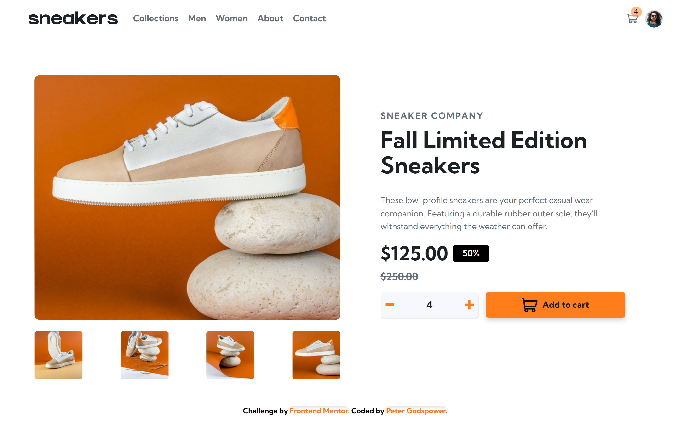
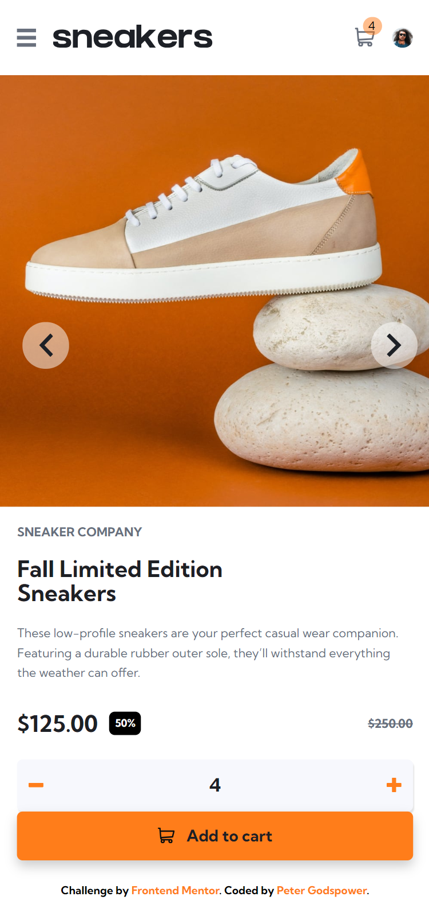

# Frontend Mentor | E-commerce Product Page

This is a solution to the E-commerce Product Page challenge on Frontend Mentor. The project involves creating an interactive product page with responsive design elements, including a cart management system and a modern image slider.

## Table of Contents

- [Overview](#overview)
  - [Screenshot](#screenshot)
  - [Links](#links)
- [My Process](#my-process)
  - [Built With](#built-with)
  - [What I Learned](#what-i-learned)
  - [Continued Development](#continued-development)
  - [Useful Resources](#useful-resources)
- [Author](#author)
- [Acknowledgments](#acknowledgments)

## Overview

### Screenshot

### Links

- Solution URL: [Frontend Mentor Solution](https://www.frontendmentor.io/solutions/e-commerce-product-page)
- Live Site URL: [Live Demo](https://thebeyonder616.github.io/Frontend-Mento-E-commerce-Product-Page)

## My Process

I developed an e-commerce product page with a modern, responsive design. Key features include a dynamic image slider, a cart management system with persistent storage, and interactive elements for a seamless user experience.

### Built With

- **Semantic HTML5 Markup:** Structured the page using modern HTML elements for better accessibility and readability.
- **SCSS:** Used SCSS for enhanced styling capabilities, including variables, nesting, and mixins for maintainable and scalable CSS.
- **CSS Custom Properties:** Employed CSS variables for consistent styling and easier theming.
- **Flexbox & Grid:** Applied for layout and alignment, ensuring a responsive design across different devices.
- **JavaScript:** Managed dynamic elements including sliders, cart updates, and persistent data handling.
- **Local Storage:** Used `localStorage` to save and retrieve cart information.

### What I Learned

This project enhanced my skills in:

- **SCSS:** Leveraging SCSS features like variables, mixins, and nesting for more efficient and organized CSS.
- **JavaScript Event Handling:** Implementing functionality for sliders and cart interactions.
- **Responsive Design:** Utilizing CSS Grid and Flexbox to create a layout that adapts to various screen sizes.
- **Performance Optimization:** Using lazy loading for images and managing local storage for improved performance.
- **Data Persistence:** Leveraging `localStorage` to maintain cart state across page reloads.

### Continued Development

Future improvements will focus on:

- **Advanced JavaScript Features:** Adding more interactive elements and improving user interaction handling.
- **CSS Animations:** Exploring advanced animations for a more engaging user interface.
- **Accessibility Enhancements:** Ensuring that all interactive components are fully accessible to users with diverse needs.

### Useful Resources

- [MDN Web Docs](https://developer.mozilla.org/en-US/) - Comprehensive documentation for web technologies.
- [CSS-Tricks](https://css-tricks.com/) - Tutorials and articles on modern CSS techniques.
- [Sass Documentation](https://sass-lang.com/documentation) - Official documentation for SCSS and Sass.
- [JavaScript.info](https://javascript.info/) - In-depth JavaScript tutorials and guides.
- [Frontend Mentor](https://www.frontendmentor.io/) - Platform for frontend challenges and community feedback.

## Author

- **Frontend Mentor:** [@TheBeyonder616](https://www.frontendmentor.io/profile/@TheBeyonder616)
- **GitHub:** [@TheBeyonder616](https://github.com/@TheBeyonder616)

## Acknowledgments

Special thanks to Frontend Mentor for providing this engaging challenge and to the community for their valuable feedback and support.
